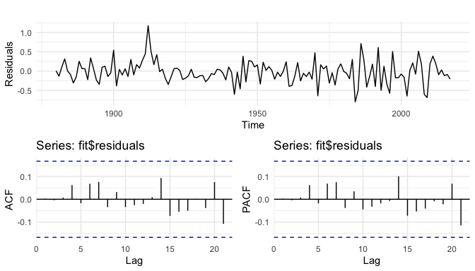
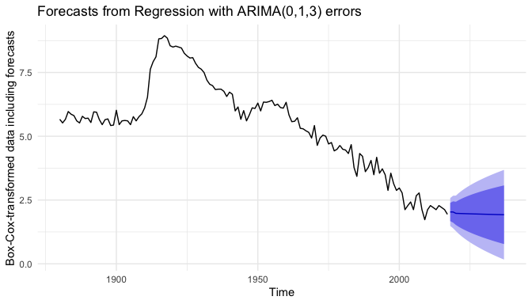

## Setup

The following analysis requires the following external R libraries.

```r
library(babynames)                    # US baby names between 1880 and 2017
library(tidyverse)                    # Data tidying/manipulation/visualisation
library(zoo)                          # For `na.approx`
library(forecast)                     # For `auto.arima`
library(ggpubr)                       # For `ggarrange`
library(TSA)                          # For `arimax`
```


## Introduction

This analysis was born out of a [question on Stack Overflow](https://stackoverflow.com/questions/60425596/best-prediction-model-method-for-predicting-baby-names-by-year) which asked whether it was possible to predict baby names based on historic data on the popularity of names.

My initial answer at the time was basically "No", as the popularity of names have often been affected by historical, sociological and other generally unforeseeable events. For example, it is well documented that the popularity of English baby names has been affected by the names of ruling royalty. An example is the pattern in the popularity of the name "Mary" which coincides with significant historic events in the life of Queen [Mary of Teck](https://en.wikipedia.org/wiki/Mary_of_Teck). In other cases, significant historic events have lead to a dramatic increase/decrease in the popularity of certain names. An (in)famous example for this phenomenon is the popularity of the name "Adolph"/"Adolf", which has seen a dramatic increase in popularity during the early years of the 1910s, followed by a near-exponential decrease in popularity from the late 1910s onwards.

In the following analysis, I will show how in the case of the popularity of the name "Adol[ph|f]" we can use time-series analysis strategies to gain an insight into underlying time-series processes.


## The data

We start by extracting data for the name "Adolph"/"Adolf" from the package [`babynames`]() which provides US baby names data from social security number applications between 1880 and 2017.   


```r
ts <- babynames %>%
    filter(name %in% c("Adolph", "Adolf")) %>%
    group_by(year) %>%
    summarise(n = sum(n)) %>%
    full_join(data.frame(year = seq(min(.$year), max(.$year)))) %>%
    arrange(year) %>%
    pull(n) %>%
    ts(start = 1880, frequency = 1) %>%
    na.approx()
```

```
## Joining, by = "year"
```

Since data for years 2012 and 2015 are missing, we need to replace `NA`s with "sensible" values. We use `zoo::na.approx` to replace missing counts with interpolated values. Let's take a look at the raw data:


```r
autoplot(ts) + theme_minimal() + labs(y = "Counts")
```

<!-- -->


## Data transformation

When dealing with count data, it is often useful to log-transform values to ensure normaly-distributed residuals. Alternatively we can use `forecast::BoxCox` to perform a [Box-Cox transformation](https://en.wikipedia.org/wiki/Power_transform#Box%E2%80%93Cox_transformation) of the data
$$
y_t' = f(y_t; \lambda) = \begin{cases}\dfrac{y_t^\lambda - 1}{\lambda}\quad&\text{$\lambda \neq 0$}\\\log{y_t}\quad&\text{$\lambda = 0$}\end{cases}
$$
using an optimal value for $\lambda$ (see `?forecast::BoxCox` for details/references on how this value is determined).

In our case

```r
lambda <- BoxCox.lambda(ts)
lambda
```

```
## [1] 0.08813758
```

We note that the optimal $\lambda$ parameter is close to zero, suggesting an optimal transformation that is very close to a log-transformation.

We proceed by Box-Cox-transforming our data using the optimal $\lambda$ values.

```r
ts <- BoxCox(ts, lambda = lambda)
```

Let's take a look at the differenced and Box-Cox-transformed data

```r
autoplot(diff(ts)) +
    theme_minimal() +
    labs(y = "Lag-1 differenced & Box-Cox-transformed counts") +
    annotate(
        "rect",
        xmin = 1910, xmax = 1917, ymin = 0.4, ymax = 1.2,
        fill = "orange", alpha = 0.2, size = 1)
```

<!-- -->

The data show some more-or-less stationary periods; we also see some spikes that are indicative of non-stationary events, the most obvious ones around the year 1912 (highlighted by the orange box).


## ARIMA model

We ignore these spikes and other time-series abnormalities for now, and use `forecast::auto.arima` to obtain a rough idea about the underlying ARIMA process. We have already seen that lag-1 differencing leads to more-or-less stationary periods, so we expect this feature to show up in the "optimal" ARIMA model.


```r
fit <- auto.arima(ts)
fit
```

```
## Series: ts
## ARIMA(0,1,3)
##
## Coefficients:
##           ma1     ma2     ma3
##       -0.2568  0.0335  0.2605
## s.e.   0.0824  0.0833  0.0753
##
## sigma^2 estimated as 0.09039:  log likelihood=-28.38
## AIC=64.77   AICc=65.07   BIC=76.45
```

The optimal MA(3) model with a single order of differencing can be written as
$$
\begin{aligned}
y_t - y_{t-1} &= \left(1 + \theta_1 B^1 + \theta_2 B^2 + \theta_3 B^3\right) \epsilon_t\\
&= \epsilon_t + \theta_1 \epsilon_{t-1} + \theta_2 \epsilon_{t-2} + \theta_3 \epsilon_{t-3}\,,
\end{aligned}
$$
with
$$
\begin{aligned}
\theta_1 &= -0.2568\\
\theta_2 &= +0.0335\\
\theta_3 &= +0.2605\\
\epsilon &\sim N(0, 0.09)
\end{aligned}
$$

We take a look at the fit residuals and their ACF and PACF

```r
gg1 <- autoplot(fit$residuals) + theme_minimal() + labs(y = "Residuals")
gg2 <- autoplot(acf(fit$residuals, plot = FALSE)) + theme_minimal()
gg3 <- autoplot(pacf(fit$residuals, plot = FALSE)) + theme_minimal()
ggarrange(gg1, ggarrange(gg2, gg3, ncol = 2), nrow = 2)
```

<!-- -->

## Transfer function model

We now return to the spikes seen around year 1912 in both the differenced & Box-Cox-transformed data and the ARIMA(0, 1, 3) model residuals. An interesting question in the context of time-series intervention analysis may be to ask when did these (intervention) events take place and what was their effect on the popularity of the name. To do so, we can use an ARIMAX model which we build around the ARIMA(0, 1, 3) model inferred from `auto.arima`. We consider a range of different intervention years between 1910 and 1920, and fit separate ARIMAX models for separate intervention years. For every model we then extract the model coefficients along with the models' AIC and log-likelihood values.

One important question to address is: How do we model the intervention effect? A sufficiently general approach is to model the intervention effect at time $T$ as a constant + AR(1) process
$$
m_t = \omega_0 P_t^T + \frac{\omega_1}{1 - \omega_2 B}P_t^T\,,
$$
where $P_t^T$ is the pulse dummy variable
$$
P_t^T = \begin{cases}1, &\text{if $t=T$}\\0,&\text{otherwise,}\end{cases}
$$

and $\omega_0 + \omega_1$ characterises the instantenous effect at $t = T$, and $\omega_2$ characterises the decaying effect of the event for $t > T$. We notice that the second term describes a geometric lag process, since
$$
\frac{\omega_1}{1-\omega_2 B} = \omega_1\left(1 + (\omega_2 B) + (\omega_2 B)^2 + (\omega_2 B)^3 + \ldots\right)\,.
$$

Let's fit the model:


```r
df <- imap(
    setNames(1910:1920, 1910:1920), ~arimax(
        ts,
        order = c(0, 1, 3),
        xtransf = data.frame(
            I = +(time(ts) == .x),
            I = +(time(ts) == .x)),
        transfer = list(c(0, 0), c(1, 0)))) %>%
    map(~ c(.x$coef, AIC = .x$aic)) %>%
    map_df(bind_rows, .id = "yr_intervention") %>%
    mutate(yr_intervention = as.numeric(yr_intervention))
df
```

```
## # A tibble: 11 x 8
##    yr_intervention    ma1      ma2   ma3  `I-MA0` `I.1-AR1` `I.1-MA0`   AIC
##              <dbl>  <dbl>    <dbl> <dbl>    <dbl>     <dbl>     <dbl> <dbl>
##  1            1910 -0.277  0.0273  0.255  20.5       0.0195   -20.8    64.8
##  2            1911 -0.375 -0.0456  0.182  -1.20      0.981      1.62   48.7
##  3            1912 -0.409 -0.0890  0.203  -0.560     0.979      1.73   47.5
##  4            1913 -0.256  0.0429  0.254  -0.146    -0.535      0.242  67.8
##  5            1914 -0.261  0.0251  0.253  20.2      -0.0118   -20.3    67.4
##  6            1915 -0.274  0.00581 0.221  -0.0624    0.926      0.647  64.5
##  7            1916 -0.263  0.0342  0.260  18.0      -0.0129   -17.9    67.7
##  8            1917 -0.255  0.0360  0.258  -7.05      0.0149     7.28   67.8
##  9            1918 -0.262  0.0391  0.261 -12.2      -0.0144    12.2    68.2
## 10            1919 -0.264  0.0408  0.265   0.917     0.214     -1.18   67.1
## 11            1920 -0.260  0.0361  0.264   1.57      0.0127    -1.73   68.3
```

We see that an ARIMA(0, 1, 3) model with an intervention in year 1912 gives the best fit to the data, resulting in the smallest AIC. The model parameters for the ARIMA and intervention processes are

$$
\begin{aligned}
\theta_1 &= -0.409\\
\theta_2 &= -0.089\\
\theta_3 &= +0.203\\
\omega_0 &= -0.560\\
\omega_1 &= +1.730\\
\omega_2 &= +0.979
\end{aligned}
$$


## Forecasting

Now that we have a best-fit ARIMAX model, we are in a position to make predictions. Since `forecast` does not accept `Arimax` objects, we need to account for the intervention by providing the effect of the intervention as an external regressor.

We first extract parameters for the optimal ARIMAX model

```r
pars <- df[which.min(df$AIC), ]
pars
```

```
## # A tibble: 1 x 8
##   yr_intervention    ma1     ma2   ma3 `I-MA0` `I.1-AR1` `I.1-MA0`   AIC
##             <dbl>  <dbl>   <dbl> <dbl>   <dbl>     <dbl>     <dbl> <dbl>
## 1            1912 -0.409 -0.0890 0.203  -0.560     0.979      1.73  47.5
```

We then calculate the contribution from each summand in $m_t$

```r
h <- 20
term1 <- stats::filter(
    +(seq(start(ts)[1], end(ts)[1] + h) == pars$yr_intervention),
    filter = 1) * pars$`I-MA0`
term2 <- stats::filter(
    +(seq(start(ts)[1], end(ts)[1] + h) == pars$yr_intervention),
    filter = pars$`I.1-AR1`,
    method = "recursive") * pars$`I.1-MA0`
xreg <- (term1 + term2)[1:length(ts)]
```

We then fit an ARIMA model where we supply the interaction effect as an external regressor

```r
fit <- Arima(ts, order = c(0, 1, 3), xreg = xreg)
fit
```

```
## Series: ts
## Regression with ARIMA(0,1,3) errors
##
## Coefficients:
##           ma1      ma2     ma3    xreg
##       -0.4030  -0.0864  0.2048  1.0053
## s.e.   0.0874   0.0922  0.0802  0.2055
##
## sigma^2 estimated as 0.07796:  log likelihood=-17.74
## AIC=45.47   AICc=45.93   BIC=60.07
```

It is instructive to compare the visualisation of the original (Box-Cox-transformed) data, model residuals and contributions from the interaction effect separately.

```r
gg1 <- autoplot(ts(xreg, start = start(ts), frequency = 1)) +
    theme_minimal() +
    labs(y = "Intervention effect")
gg2 <- autoplot(fit$residuals) +
    theme_minimal() +
    ylim(-1.1, 1.1) +
    labs(y = "Residuals")
gg3 <- autoplot(fit$residuals + c(0, diff(xreg))) +
    theme_minimal() +
    labs(y = "Res + diff'ed intervention")
gg4 <- autoplot(diff(ts)) +
    theme_minimal() +
    ylim(-1.1, 1.1) +
    labs(y = "Box-Cox-transformed data")
ggarrange(gg1, gg2, gg3, gg4, nrow = 4)
```

<!-- -->

Note that we have to add the lag-1 differenced data to the model residuals when we want to show the superposition of both.

## Outlook

It is clear from the model residuals that the ARMAX model with a single intervention does not capture all features and abnormalities in the data. Therefore results from such an analysis need to be taken with a large grain of salt.

If we press ahead and blatantly ignore these warnings, we may use the model to predict the popularity into the future

```r
autoplot(forecast(fit, h, xreg = tail(term1 + term2, h))) +
    theme_minimal() +
    labs(y = "Box-Cox-transformed data including forecasts")
```

<!-- -->
